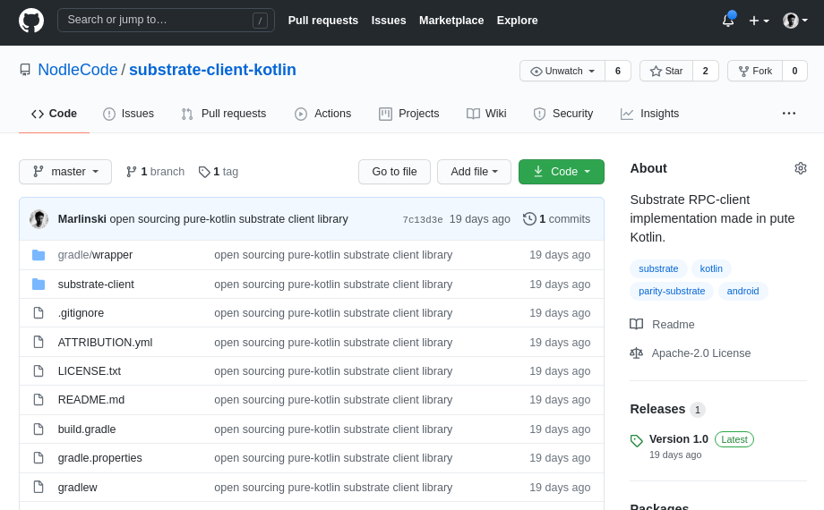
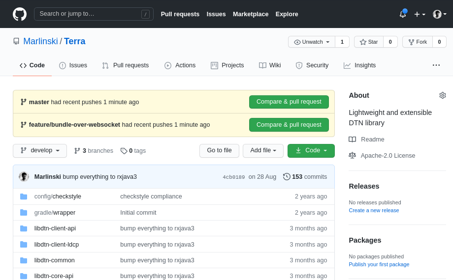
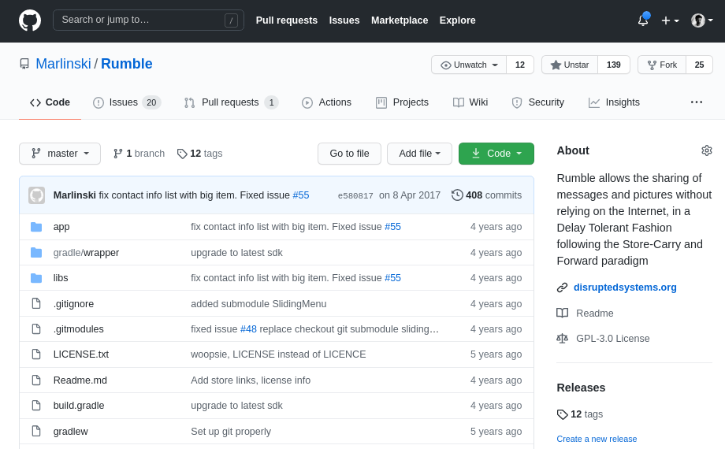
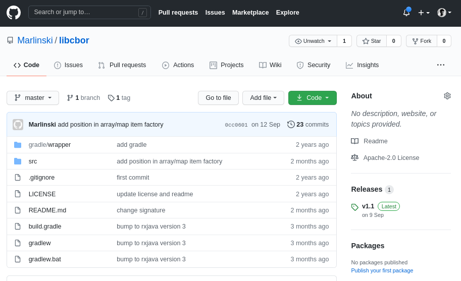

 <a href="presentations">presentations</a> <a href="teachings"> teachings</a>
   

Expert in decentralized and distributed network. My current interest edge toward Blockchain technology.

Following are some of the projects I developed. You can view all of them on <a href="https://github.com/Marlinski">GitHub</a>.

  
  

    <h4><a href="https://github.com/NodleCode/substrate-client-kotlin"><b>Substrate Client</b></a></h4> 
    
RPC client for Parity Substrate Chain, written in Kotlin
 
  

  
  

    <h4><a href="https://github.com/Marlinski/Terra"><b>Terra</b></a></h4> 
    
Lightweight and extensible <a href="https://tools.ietf.org/html/draft-ietf-dtn-bpbis-28">DTN library </a> implementation
 
  

  
  

    <h4><a href="https://github.com/Marlinski/Rumble"><b>Rumble</b></a></h4> 
    
Rumble is an entirely <b>off-the-grid</b> micro-blogging app.
 
  

  
  

    <h4><a href="https://github.com/Marlinski/libcbor"><b>libcbor</b></a></h4> 
    
Reactive <a href="https://tools.ietf.org/html/rfc7049">CBOR</a> encoder and parser
 
  

