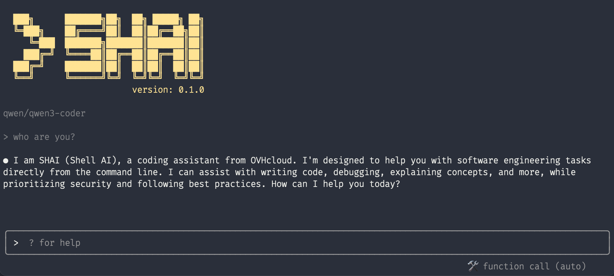
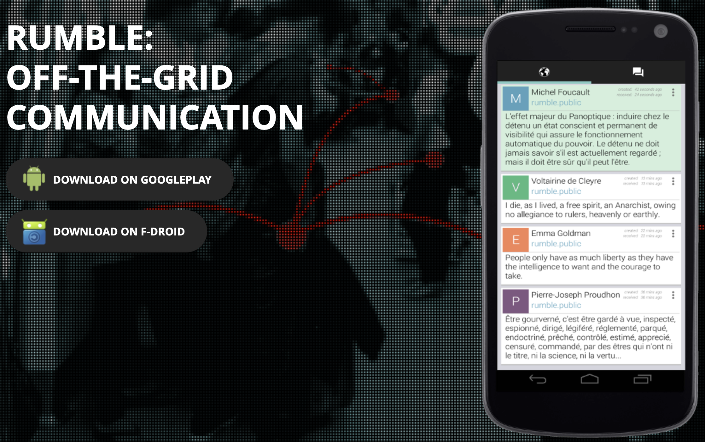
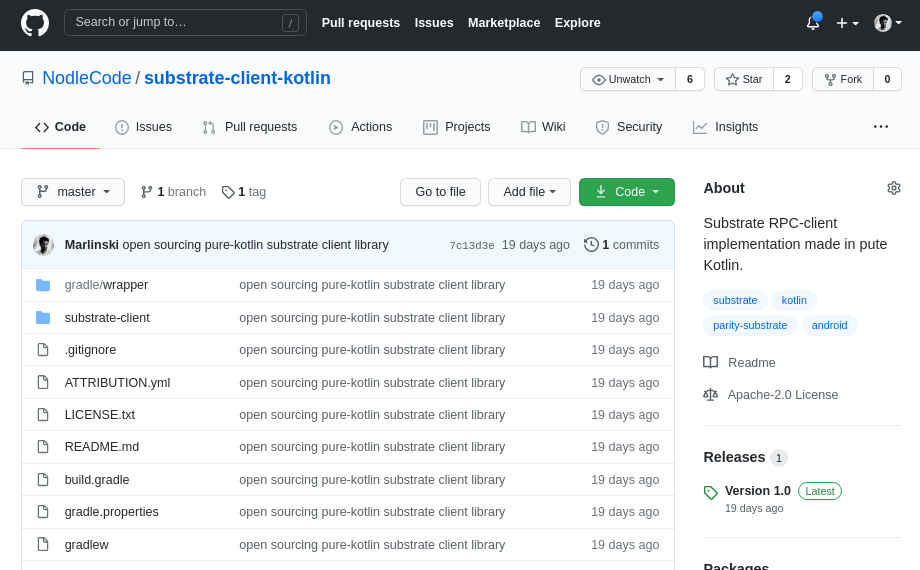
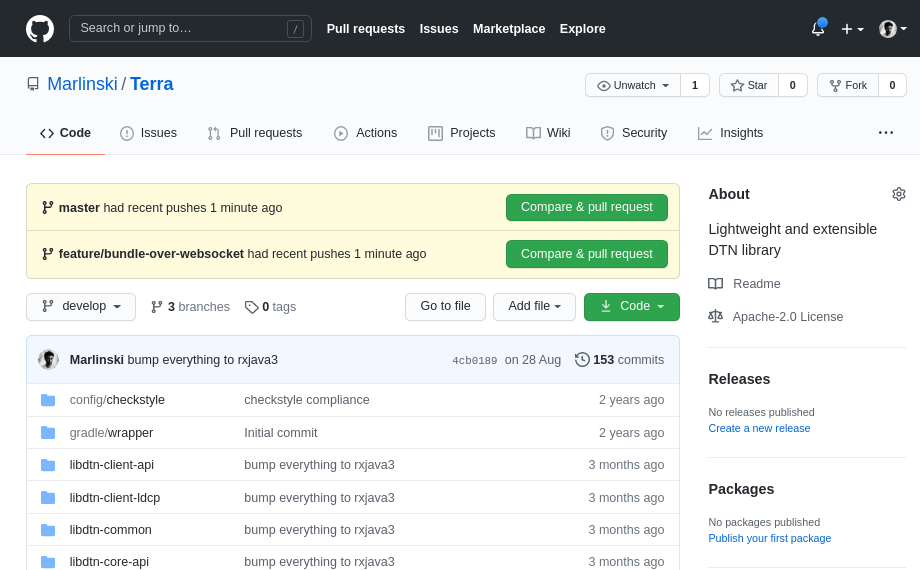

 <a href="presentations">presentations</a> <a href="teachings"> teachings</a>
   

Research Engineer | AI | Blockchain & Cryptography | Decentralized Networks.

International experience (France, Singapore, US, Canada) I have great passion for new and innovative technologies that enables communication between people, devices and places. Currently working at OVHcloud building <a href="https://github.com/ovh/shai">AI Agents</a> 🤖 !

Following are some of the projects I developed. You can view all of them on <a href="https://github.com/Marlinski">GitHub</a>.

  
  

    <h4><a href="https://github.com/NodleCode/substrate-client-kotlin"><b>SHAI</b></a></h4> 
    
shai is a coding agent, your pair programming buddy that lives in the terminal. Written in Rust
 
  

  
  

    <h4><a href="https://github.com/Marlinski/Rumble"><b>Rumble</b></a></h4> 
    
Rumble is an entirely <b>off-the-grid</b> micro-blogging app. Think Twitter but no internet!
 
  

  
  

    <h4><a href="https://github.com/NodleCode/substrate-client-kotlin"><b>Substrate Client</b></a></h4> 
    
RPC client for Parity Substrate Chain (polkadot), written in Kotlin
 
  

  
  

    <h4><a href="https://github.com/Marlinski/Terra"><b>Terra</b></a></h4> 
    
Lightweight and extensible <a href="https://tools.ietf.org/html/draft-ietf-dtn-bpbis-28">DTN library </a> implementation
 
  

