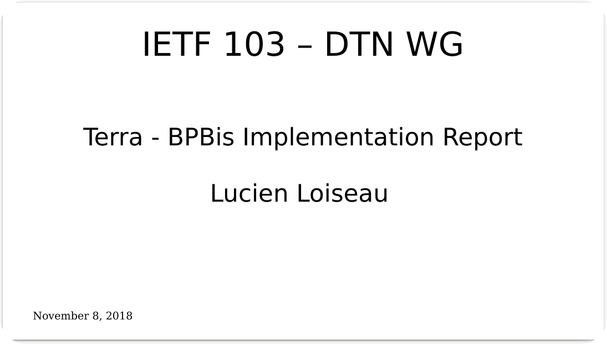

[← presentations](/presentations)
# Terra: A Delay Tolerant Network Implementation

[![CC BY 4.0][cc-by-shield]][cc-by]

This page contains the material for the presentation I gave in Bangkok (Thailand) during the IETF 103 for the DTN Working Group. During this talk, I presented [Terra](https://github.com/Marlinski/Terra/), an implementation of the [Bundle Protocol](https://tools.ietf.org/html/draft-ietf-dtn-bpbis-28).

A video of the presentation is available [here](https://www.youtube.com/watch?v=_zowxNBLRQ8#t=1h12m45)

## Terra Source Code

The source code for Terra is available on Github:

[![Github][github]](https://github.com/Marlinski/Terra/)

## Licence

This work is licensed under a
[Creative Commons Attribution 4.0 International License][cc-by].

[![CC BY 4.0][cc-by-image]][cc-by]

[github]: /static/github-badge.svg
[screenshot]: images/presentation-screenshot.png
[cc-by]: http://creativecommons.org/licenses/by/4.0/
[cc-by-image]: https://i.creativecommons.org/l/by/4.0/88x31.png
[cc-by-shield]: https://img.shields.io/badge/License-CC%20BY%204.0-lightgrey.svg

## Author

Lucien Loiseau, November, 2018

