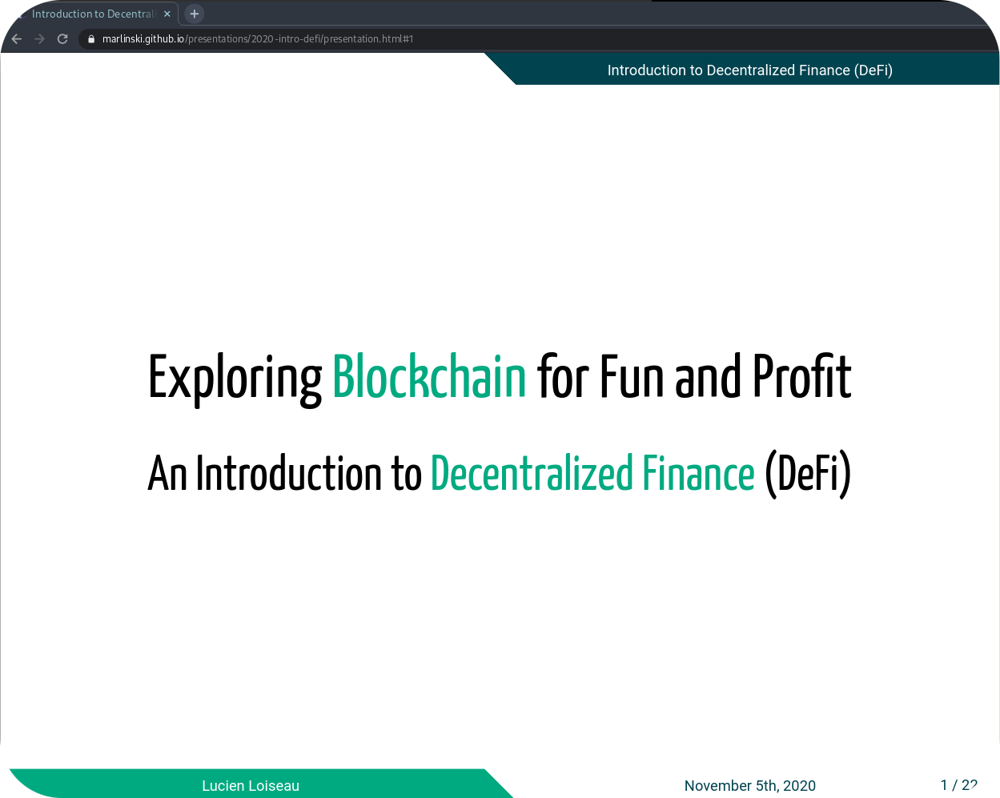

[← presentations](/presentations)
# An Introduction to Decentralized Finance (DeFi)

[![CC BY 4.0][cc-by-shield]][cc-by]

This page contains the source for the presentation I gave for [CodaPay](https://www.codapayments.com/) as part of the Lunch & Learn Session. 

This presentation is done using [Remark.js](https://github.com/gnab/remark), an in-browser slideshow generator.

## See the slides

click on the image to see the slides directly in-browser:

<p align="center">
<a href="https://marlinski.github.io/presentations/2020-intro-defi/presentation.html"></a>
</p>

## Source

The source for the slides are available on github:


[![Github][github]](https://github.com/Marlinski/Marlinski.github.io/tree/master/presentations/2020-intro-defi)


To run this presentation, run the following command at the root of this folder:

```
python -m http.server
```
if you have python2.x instead of python3.x then run this command instead:

```
python -m SimpleHTTPServer 8000
```

you can then open your browser at [http://localhost:8000/presentation.html](http://localhost:8000/presentation.html)


## Licence

This work is licensed under a
[Creative Commons Attribution 4.0 International License][cc-by].

[![CC BY 4.0][cc-by-image]][cc-by]

[github]: /static/github-badge.svg
[screenshot]: images/presentation-screenshot.png
[cc-by]: http://creativecommons.org/licenses/by/4.0/
[cc-by-image]: https://i.creativecommons.org/l/by/4.0/88x31.png
[cc-by-shield]: https://img.shields.io/badge/License-CC%20BY%204.0-lightgrey.svg


## Author

Lucien Loiseau, November, 2020

