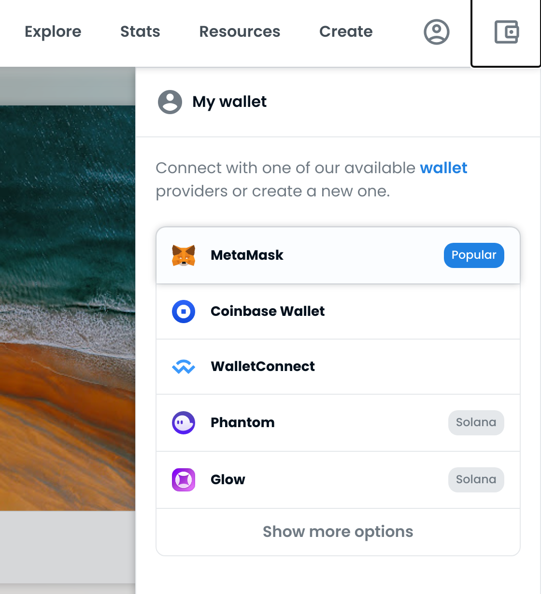

:point_up: Codelab NFT - 18 Mai 2022 :construction:
===

# :construction_worker: Plan de la session

Le but de ce codelab est de réaliser un smart contract NFT pour une image unique que nous souhaitons vendre à plusieurs exemplaires. Vous allez apprendre:

:one: Ajouter une images sur IPFS

:two: Création d'un smart contract ERC721 avec remix

:three: Création d'un Minter

:four: Deployer sur un testnet (Rinkeby)

:five: Intégrer avec opensea

:six: Faire un site web pour le minting

Il n'y a plus qu'à suivre les :point_right: et lire attentivement les points d'information :pushpin:.

## :memo: Prerequis

La plupart des outils utilisés dans ce codelab seront disponible directement depuis le browser. Nous aurons donc besoin que d'un laptop et d'un navigateur.

# :fireworks: 1. Hébergement de l'image sur IPFS

> :pushpin: IPFS (Interplanetary FileSystem) est une solution de stockage de fichier distribué et décentralisé reposant sur la technologie DHT (similaire à bittorrent). Contrairement à une solution de type Amazon S3, les resources ne sont pas identifiés par une URL mais par un hash appelé CID, qui fournit une empreinte unique du fichier.

Un smart contrat de type NFT ne s'occupe que de la gestion des titres de propriétés mais ne contient pas les images directement car cela serait trop coûteux à stocker sur la blockchain. À la place les NFT "pointent" sur le hash de l'image afin d'identifier uniquement la donnée ciblée. il est standard d'utiliser l'URI `ipfs://` pour comprendre qu'il s'agit d'un contenu hébergé sur IPFS comme par exemple: `ipfs://QmU7sxwp4cT1ogYVSbNZjYYLZy4udgvZFWN7Q5wDNdMhB9`. L'avantage de cette représentation c'est que ce hash sera toujours valide indépendemment de sa disponibilité ou non sur le réseau.


## 1.1. Création d'une image

:point_right: Créer une image qui sera la base de votre NFT. Cela peut être n'importe quel type de fichier, image, son ou même video. Pour le reste de ce codelab j'utiliserais le fichier [nft-data/codelab-image](nft-data/codelab-image.png) mais vous pouvez expérimentez avec votre propre image bien entendu!

<kbd></kbd>


## 1.2. Pinning de l'image sur IPFS

Comme sur bittorrent, pour qu'un fichier soit disponible au téléchargement il faut qu'il soit mis à disposition par au moins un nœud IPFS. Le fait de rendre un fichier disponible s'appelle le "pinning", pour cela nous pouvons utiliser différents services tel que [nft.storage](https://nft.storage) ou [pinata](https://app.pinata.cloud/pinmanager). 

:point_right: Choisissez un des deux fournisseurs, créez un compte puis uploadez votre fichier image.

<kbd></kbd>

<kbd></kbd>

<kbd></kbd>

Une fois le fichier uploadé, vous obtenez un CID, c'est à dire son hash. Par exemple celui pour l'image du codelab est `QmU7sxwp4cT1ogYVSbNZjYYLZy4udgvZFWN7Q5wDNdMhB9`. IPFS étant un seul réseau partagé, indépendemment de chez qui vous l'avez uploadé il devient accessible depuis n'importe quel [ipfs gateway](https://ipfs.github.io/public-gateway-checker/) comme par exemple:

- [https://ipfs.io/ipfs/QmU7sxwp4cT1ogYVSbNZjYYLZy4udgvZFWN7Q5wDNdMhB9](https://ipfs.io/ipfs/QmU7sxwp4cT1ogYVSbNZjYYLZy4udgvZFWN7Q5wDNdMhB9)
- [https://dweb.link/ipfs/QmU7sxwp4cT1ogYVSbNZjYYLZy4udgvZFWN7Q5wDNdMhB9](https://dweb.link/ipfs/QmU7sxwp4cT1ogYVSbNZjYYLZy4udgvZFWN7Q5wDNdMhB9)
- [https://gateway.pinata.cloud/ipfs/QmU7sxwp4cT1ogYVSbNZjYYLZy4udgvZFWN7Q5wDNdMhB9](https://gateway.pinata.cloud/ipfs/QmU7sxwp4cT1ogYVSbNZjYYLZy4udgvZFWN7Q5wDNdMhB9)

par ailleurs, si vous avez ipfs d'installé sur votre machine vous pouvez même le récupérer directement en ligne de commande depuis le protocole IPFS:

```bash 
$ ipfs get QmU7sxwp4cT1ogYVSbNZjYYLZy4udgvZFWN7Q5wDNdMhB9

Saving file(s) to QmU7sxwp4cT1ogYVSbNZjYYLZy4udgvZFWN7Q5wDNdMhB9
55.47 KiB / 55.47 KiB [=============================] 100.00% 0s
```

## 1.3. Création du fichier metadata.json

Pour des raisons d'intégration du NFT avec des plateformes comme OpenSea, il est nécessaire d'avoir un fichier `metadata.json` qui contiendra entre autre le hash de l'image (récupéré à l'étape précédente) et des informations contextuelles (voir [https://docs.opensea.io/docs/metadata-standards](https://docs.opensea.io/docs/metadata-standards)).

<kbd></kbd>

:point_right: Créez un fichier metadata comme suit en indiquant bien le CID obtenu à l'étape précédente dans le champs "image" prefixé par `ipfs://`, vous pouvez également changer les autres champs comme bon vous semble:

```metadata.json
{
    "description": "Codelab NFT - 18 Mai 2022", 
    "external_url": "https://blockchainsociete.org", 
    "image": "ipfs://REMPLACER-PAR-LE-CID-DE-VOTRE-IMAGE", 
    "name": "Blockchain Et Societe",
    "attributes": []
}
```

:point_right: Uploadez ce fichier de metadata sur votre service de pinning. C'est ce CID du fichier metadata qui sera utilisé par notre smart contract pour le `tokenURI`.


# :scroll: 2. Création d'un Smart Contract ERC721  avec Solidity

> :pushpin: Solidity est un langage orienté objet permettant le développement de smart contract sur les blockchains de type EVM. Il existe de nombreux outils pour développer avec Solidity mais dans ce codelab nous nous contenterons d'utiliser [remix](https://remix.ethereum.org/), un IDE en ligne permettant de facilement expérimenter avec solidity. 

## Étape 2.1 : Mise en place

:point_right: Connectez vous à [remix](https://remix.ethereum.org/). Créez un nouveau workspace "codelab" en cliquant sur le petit plus en haut à gauche. Votre workspace contient par défaut trois repertoires:

- contracts
- tests
- scripts

<kbd></kbd>

Nous allons commencer par le nettoyer un peu. Supprimez tout les fichiers présents dans `contracts` ainsi que dans `tests` afin de démarrer avec un projet clean, laissez le repertoire `scripts` intact.

## Étape 2.2 : Smart Contract ERC-721

Un NFT est un smart contract qui implémente le standard ERC-721 définit dans l'[EIP 721](https://eips.ethereum.org/EIPS/eip-721). Ici, nous allons utiliser une implémentation déjà existante fournit par [OpenZeppelin](https://www.openzeppelin.com/).

:point_right: Nous allons maintenant écrire notre premier smart contract ERC721, dans le repertoire `contracts`, créez le fichier `NFTCollection.sol`:

```solidity
// SPDX-License-Identifier: MIT
pragma solidity ^0.8.12;

// Import of ERC721 Enumerable standard
import "@openzeppelin/contracts/token/ERC721/extensions/ERC721Enumerable.sol";
// Import of Ownable standard
import "@openzeppelin/contracts/access/Ownable.sol";
// Import of Strings standard
import "@openzeppelin/contracts/utils/Strings.sol";


contract NFTCollection is ERC721Enumerable, Ownable {
  string public uri;

  constructor(string memory _name, string memory _symbol, string memory _uri) ERC721(_name, _symbol) {
    uri = _uri;
  }
}
```

> :pushpin: En appuyant sur `ctrl+s` remix va automatiquement lancer la compilation du fichier. Dans l'onglet de compilation "Solidity Compiler" vérifiez que la version `0.8.12` est sélectionné

> :pushpin: En compilant ce smart contract, remix récupère automatiquement toutes les dépendences, Je vous invite à étudier l'implémentation ERC721 disponible dans le fichier `.deps/npm/@openzeppelin/contracts/token/ERC721/ERC721.sol` qui implémente l'interface `.deps/npm/@openzeppelin/contracts/token/ERC721/IERC721.sol`.

:point_right: ajoutez ces deux fonctions à votre contrat qui vont nous permettre de mint des tokens et de les faire pointer vers le fichier de metadata.

```solidity
  function tokenURI(uint256 tokenId) public view virtual override returns (string memory) {
    require(_exists(tokenId), "NFTCollection: token does not exist");
    return string(uri);
  }

 
  function mint(address recipient) public onlyOwner returns(uint256) {
    uint256 tokenId = this.totalSupply();
    _safeMint(recipient, tokenId);
    return tokenId;
  }
```

On constate que l'accès à la fonction mint est restreinte à l'owner par le modificateur `onlyOwner`. Par défaut l'owner est le compte ayant déployé le contrat. Vous pouvez voir les détails de cette librairie dans le fichier `.deps/npm/@openzeppelin/contracts/access/Ownable.sol` 

## Étape 2.2 : Unit testing du contrat

Il est important de bien unit-tester les contrats que vous écrivez. Il existe plusieurs framework pour tester comme la suite `truffle`, `hardhat/chai` mais pour ce codelab nous allons utiliser "Solidity Unit Testing" disponible en plugin dans remix. 

:point_right: Installez le plugin `Solidity Unit Testing` disponible dans le plugin manager situé en bas à gauche. Une fois installé vous disposerez d'un nouvel onglet pour lancer vos tests.

<kbd></kbd>
<kbd></kbd>

:point_right: Dans le répertoire `tests` créez un nouveau fichier `nft_collection_test.sol`:

```solidity
// SPDX-License-Identifier: GPL-3.0
        
pragma solidity >=0.4.22 <0.9.0;

import "remix_tests.sol"; 
import "remix_accounts.sol";
import "contracts/NFTCollection.sol";

// File name has to end with '_test.sol', this file can contain more than one testSuite contracts
contract CollectionTest is NFTCollection {

    constructor() NFTCollection("Codelab - 18 Mai 2022", "CDLB", "ipfs://QmcDcViB3iS2sqAPK7YLnoyu5xmY1LThpbjZAztikEQYT5") {}

    /// Define variables referring to different accounts
    address acc0;
    address acc1;
    address acc2;
    
    /// Initiate accounts variable
    function beforeAll() public {
        acc0 = TestsAccounts.getAccount(0); 
        acc1 = TestsAccounts.getAccount(1);
        acc2 = TestsAccounts.getAccount(2);
    }
    
    function initialSupplyShouldBe0() public returns (bool) {
        return Assert.equal(totalSupply(), 0, "initial supply is not correct");
    } 

    /// #sender: account-0
    function checkOwnerCanMint() public returns (bool) {
        mint(TestsAccounts.getAccount(1)); // should succeed
        return Assert.equal(tokenOfOwnerByIndex(TestsAccounts.getAccount(1),0), 0, "wrong owner for token");
    }

    /// check tokenURI for freshly minted token
    function checkTokenUri() public returns (bool) {
        return Assert.equal(tokenURI(0), "ipfs://QmcDcViB3iS2sqAPK7YLnoyu5xmY1LThpbjZAztikEQYT5", "wrong token Uri");
    }

    /// #sender: account-1
    function checkNonOwnerCannotMint() public returns (bool) {
        try this.mint(TestsAccounts.getAccount(1)){
            return Assert.ok(false, "method execution should fail");
        } catch Error(string memory reason) {
            return Assert.equal(reason, "Ownable: caller is not the owner", "failed with unexpected reason");
        } catch (bytes memory /*lowLevelData*/) {
            return Assert.ok(false, "failed unexpected");
        }
    }

}
```

Ce contrat hérite de notre contrat NFTCollection et chaque fonction procédera à un unit test. Ici nous testons la fonction de mint, que le minter a bien reçu un token et que le tokenURI corresponde à ce que nous avons entré au constructeur. Compilez le puis allez dans l'onglet de test et lancez les tests.

<kbd></kbd>
<kbd></kbd>

Si tout se passe bien les tests vont passer avec succès. :100:


> :pushpin: les unit tests tournent sur une petite EVM en javascript locale au browser. Il n'y a donc aucune communication avec une vraie blockchain.


# :scroll: 3. Création d'un Minter

Notre contrat actual ne permet pas de "vendre" un token, c'est à dire de minter un exemplaire en échange d'ethereum. Par ailleurs il n'y a pas de limite sur le nombre de token qu'il peut émettre. 

Nous souhaitons vendre notre NFT en quantité limité. Nous allons donc créer un contrat `Minter` qui s'occupera de déployer le token et de s'occuper de la vente en fonction de paramètres donné au constructeur. Idéalement notre flow ressemblera à quelque chose comme ça:


Afin de faciliter le déploiement du contrat Minter, nous allons aussi créer un `MinterFactory` qui se contentera simplement de l'instanciation du `Minter`. Nos contrats seront donc structuré de la façon suivante:


Allons y! :fire:


## Étape 3.1 : Création du Minter

:point_right: Créez un nouveau fichier `Minter.sol`, nous allons commencer par définir les structures et notre constructeur:

```solidity
// SPDX-License-Identifier: MIT
pragma solidity ^0.8.12;

import "./NFTCollection.sol";

struct MintParams {
    uint256 tokenPrice;           // token price in wei
    address payable artistWallet; // wallet of the artist to receive payment
    uint maxSupply;               // size of the collection
}

struct NFTCollectionParams {
    string name; 
    string ticker; 
    string uri;
}

contract Minter {
    MintParams    public mintParams;
    NFTCollection public nft;

    constructor(MintParams memory _mintParams, NFTCollectionParams memory _tokenParams) {
        nft = new NFTCollection(_tokenParams.name, _tokenParams.ticker, _tokenParams.uri);
        mintParams = _mintParams;
    }
}
```

> :pushpin: Lorsqu'on déploiera le minter et que son constructeur sera appelé, le mot clé `new NFTCollection` va effectivement déployer le smart contract NFTCollection définit plus haut et il en sera donc le owner. 

:point_right: Il ne nous reste plus qu'à ajouter la fonction de mint:

```solidity
function mintNFT(address recipient) external payable returns(uint256) {
        require(
            nft.totalSupply() < mintParams.maxSupply, 
            "Minter: maximum number of token already minted"
        );

        // check if buyer sent enough ether
        uint256 mintPrice = mintParams.tokenPrice;
        uint256 payingAmount = msg.value;
        require(
            payingAmount >= mintPrice, 
            "Minter: not enough Ether to mint a token"
        );

        // mint tokens
        uint256 tokenId = nft.mint(recipient);

        // send the change back if buyer paid too much
        uint256 change = (msg.value - mintPrice);
        if (change > 0) {
            (bool changeSent, ) = msg.sender.call{value: change}("");
            require(changeSent, "Minter: Failed to send change to buyer");
        }

        // pay the artist
        (bool paymentSent, ) = mintParams.artistWallet.call{value: mintPrice}("");
        require(paymentSent, "Minter: Failed to send Ether to artist wallet"); 

        return tokenId;       
    }
```

## Étape 3.2 : Création du MinterFactory

Le MinterFactory est un contrat utilitaire avec un constructeur sans paramètre pour nous simplifier le déploiement de notre Minter. Contrairement à la relation de composition entre le `Minter` et `NFTCollection`, il s'agit ici d'une relation d'héritance.

:point_right: on crée un nouveau contrat `MinterFactory.sol` et on y met le code suivant, vous pouvez l'adapter selon vos besoin:

```solidity
// SPDX-License-Identifier: MIT
pragma solidity ^0.8.12;

import "./Minter.sol";

contract MinterFactory is Minter {
    constructor() Minter(
        MintParams({
            tokenPrice: 10000000000000000,
            artistWallet: payable(0xab57ea35F5960AB178Ea5441937b35823BCfe695),
            maxSupply: 5
        }),
        NFTCollectionParams({
            name: "mon premier NFT",
            ticker: "MPN",
            uri: "ipfs://QmcDcViB3iS2sqAPK7YLnoyu5xmY1LThpbjZAztikEQYT5"
        })
    ) {}
}
```

Vous pouvez mettre le prix que vous souhaitez pour le token (exprimé en wei). Ici `10000000000000000` wei = 0.01 eth (voir [https://eth-converter.com/](https://eth-converter.com/)). Par ailleurs artistWallet est l'adresse du compte qui recevra les paiements, changez le si vous avez déjà un wallet sinon vous pourrez le faire quand on configurera Metamask un peu plus loin.

## Étape 3.3 : Unit Testing du Minter

Comme pour le contrat ERC721, nous allons procéder à quelques unit tests pour nous assurer que le contrat Minter fonctionne correctement.

:point_right: dans le répertoire tests, créez un nouveau fichier `nft_minter_test.sol`:

```solidity
// SPDX-License-Identifier: GPL-3.0
        
pragma solidity >=0.4.22 <0.9.0;

import "remix_tests.sol"; 
import "remix_accounts.sol";
import "contracts/MinterFactory.sol";

// File name has to end with '_test.sol', this file can contain more than one testSuite contracts
contract MinterTest is MinterFactory {

    constructor() {}
    
    /// Define variables referring to different accounts
    address acc0; // minter owner
    address acc1; // artist wallet
    address acc2; // some buyer
    address acc3; // some other buyer
    
    /// Initiate accounts variable
    function beforeAll() public {
        acc0 = TestsAccounts.getAccount(0); 
        acc1 = TestsAccounts.getAccount(1);
        acc2 = TestsAccounts.getAccount(2);
        acc3 = TestsAccounts.getAccount(3);
    }

    function initialSupplyShouldBe0() public returns (bool) {
        return Assert.equal(nft.totalSupply(), 0, "initial supply is not correct");
    } 

    /// #sender: account-2
    /// #value: 9000000000000000
    function checkBuyerNotEnoughMoney() public payable returns (bool) {
        try this.mintNFT{value:msg.value}(msg.sender) {
            return Assert.ok(false, "method execution should fail");
        } catch Error(string memory reason) {
            return Assert.equal(reason, "Minter: not enough Ether to mint a token", "failed with unexpected reason");
        } catch (bytes memory /*lowLevelData*/) {
            return Assert.ok(false, "failed unexpected");
        }
    }

    /// #sender: account-2
    /// #value: 10000000000000000
    function checkBuyToken() public payable returns (bool) {
        uint256 artistAmountBefore = address(mintParams.artistWallet).balance;
        try this.mintNFT{value:msg.value}(msg.sender) {
            uint256 artistAmountAfter = address(mintParams.artistWallet).balance;
            uint256 artistPaid = artistAmountAfter - artistAmountBefore;
            return Assert.equal(artistPaid, mintParams.tokenPrice, "artist wasn't paid the right amount");
        } catch Error(string memory reason) {
            return Assert.equal(reason, "unsure", "failed with unexpected reason");
        } catch (bytes memory /*lowLevelData*/) {
            return Assert.ok(false, "failed unexpected");
        }
    }
}
```

:point_right: lancez les tests, ils devraient correctement s'exécuter :100: :100:

<kbd></kbd>

> :pushpin: pour chaque test, il est possible de debugger l'exécution en cliquant sur l'insecte. Cela vous ouvrira un utilitaire de debuggage très complet.


# :zap: 4. Déploiement sur le testnet Rinkeby 

Nous sommes maintenant prêt à déployer sur le testnet Rinkeby! Mais avant cela il nous faut un wallet qui sera utilisé pour déployer le contrat.

## 4.1 Installation de Metamask

:point_right: installez l'extension [metamask](https://metamask.io/) sur votre navigateur et créez un wallet !

<kbd></kbd>
<kbd></kbd>

> :pushpin: Même si il s'agit ici d'un codelab sans conséquence, pensez à toujours bien sauvegarder votre mnemonic quelque part en sécurité! Si vous perdez votre ordinateur ou désinstallez Metamask, la mnémonic permet de recréer votre wallet. 

une fois Metamask installé, vous devriez voir l'extension en forme de renard à droite de votre barre d'URL.

<kbd></kbd>

> :pushpin: Metamask est un wallet, c'est à dire qu'il gère votre clé privée, mais c'est aussi un web3 provider, c'est à dire qu'il peut relayer les transactions à la blockchain (il est connecté).

:point_right: Par défaut Metamask se connecte sur le mainnet d'Ethereum. Nous allons maintenant le configurer pour utiliser le réseau testnet d'Ethereum "Rinkeby". Il est possible que vous ayez à "Show/Hide test networks" pour qu'il apparaisse dans la liste.

<kbd></kbd>
<kbd></kbd>

Vous êtes connecté au Testnet Rinkeby! :100:  Maintenant il nous faut des Ethers. :point_down:

## 4.2 Obtention de testnet token

> :pushpin: Sur le réseau Mainnet d'Ethereum il n'y a que deux façons d'obtenir des token, soit on paye (par exemple sur un exchange) soit on les minent en faisant tourner un nœud Ethereum. Heureusement pour nous, obtenir des token sur Rinkeby est gratuit. 

:point_right: allez sur le faucet [https://rinkebyfaucet.com/](https://rinkebyfaucet.com/) pour obtenir des tokens. Il suffit de mettre sa clé publique puis de cliquer sur "Send Me Ether" pour obtenir 0.1 ETH. Ce service est limité à une fois par jour. Si ça ne fonctionne pas, addressez vous à un intervenant pour qu'il vous en envoie. :raised_hand:

## 4.3 Vérification du wallet de l'artiste

:point_right: Dans le contrat `Minter` si vous ne l'avez pas déjà fait avant, assurez vous que le paramètre `artistWallet` soit une clé sous votre contrôle comme par exempe le compte Metamask que vous venez de créer. Sinon les ether de la vente seront envoyé à moi !

## 4.4 Déploiement du contrat sur Rinkeby

:point_right: dans Remix, allez dans l'onglet de déploiement "Deploy & Run Transaction" et sélectionner l'environnement "Injected Web3" pour connecter Remix à Metamask. Si cela ne fonctionne pas avec l'erreur "network not detected", rafraichissez la page.

<kbd></kbd>
<kbd></kbd>

> :pushpin: les environnements vous permettent de deployer et tester vos contrats  dans différentes conditions. L'environnement *Javascript VM* est une instance en javascript, locale et non persistante (Il suffit de rafraichir la page pour reset l'environnement). *Injected Web3* correspond au réseau auquel metamask est actuellement connecté. Ganache est un environnement de test très utilisé mais qui implique de faire tourner un programme sur la machine.

Remix détecte automatiquement les comptes existant sur Metamask, si vous venez de l'installer il ne devrait y en avoir qu'un.

:point_right: pour déployer, sélectionner le contrat `MinterFactory.sol` dans la liste et cliquez sur "deploy". Vous allez devoir confirmer la transaction avec Metamask.

:bangbang: VERIFIEZ BIEN QUE VOUS SOYEZ SUR RINKEBY ET PAS SUR MAINNET !!

<kbd></kbd>
<kbd></kbd>

> Le déploiement devrait prendre quelques secondes, notez que vous pouvez suivre la transaction sur etherscan en cliquant sur le lien ["view the transaction"](https://rinkeby.etherscan.io/tx/0xff8bc35859ec16c41ad0324b5c605a6d9b46fceef0f8b66fcd0dcee116e1e99a) dans la console de debug en bas.

Une fois votre contrat déployé, une nouvelle ligne est apparu, il s'agit du contrat déployé de votre Minter. 

<kbd></kbd>
<kbd></kbd>


> :pushpin: Les boutons rouges impliquent une transaction payante, boutons oranges correspondent à des opérations en "écriture" pouvant potentiellement modifier l'état du contrat et coûte du gas pour l'exécution. Les boutons bleus ne sont que des opération de type "read" et sont gratuites car elles ne font que lire l'état de la chain et ne nécessitent pas de transaction.

:point_right: on va maintenant s'acheter un token:

- [ ] dans le champs Value mettez le montant que vous avez spécifié pour le prix du token. Si vous ne l'avez pas changé il s'agit de `10000000000000000 wei` (0.01 eth)
- [ ] Copiez l'adresse de votre account et mettez le en paramètre du bouton mintNFT. C'est pour recevoir le NFT.
- [ ] cliquez mintNFT, metamask vous demandera de valider la transaction

<kbd></kbd>
<kbd></kbd>
 
 # :ship: 5. Intégration avec OpenSea

:point_right: Rendez vous sur la page d'OpenSea et loggez vous avec Metamask (web3 login). OpenSea détecte que vous êtes connecté sur Rinkeby et vous proposera d'aller sur [https://testnets.opensea.io/](https://testnets.opensea.io/).

<kbd></kbd>

:point_right:  Pour intégrer notre NFT il faut créer une nouvelle collection. Naviguez dans le compte, collection, puis cliquez sur "ajouter un contrat existant" et sélectionnez "Live on a Testnet":

<kbd></kbd>
<kbd></kbd>
<kbd></kbd>

OpenSea nous demande d'indiquer l'adresse du contrat NFT. Il ne s'agit pas de l'adresse du contrat `Minter` mais de celui du contrat `NFTCollection` qui a été déployé par le Minter. L'adresse du contrat NFT se trouve dans les attribut de ce dernier:

<kbd></kbd>


On valide et voilà ! Notre NFT est maintenant intégré à OpenSea ! :tada: :confetti_ball: :fire:

<kbd></kbd>
<kbd></kbd>

Pour récapituler:

| Content | Address |
| --- | --- |
| Minter | [0x0d4eEaEA9F9662Ea628EFB94fFfDb07221D81318](https://rinkeby.etherscan.io/address/0x0d4eEaEA9F9662Ea628EFB94fFfDb07221D81318)
| NFTCollection | [0xD31bE8A911B29D240Ea805da09b00c3758582b27](https://rinkeby.etherscan.io/address/0xD31bE8A911B29D240Ea805da09b00c3758582b27)
| NFT on OpenSea | https://testnets.opensea.io/collection/mon-premier-nft-1 |
| IPFS image | [QmU7sxwp4cT1ogYVSbNZjYYLZy4udgvZFWN7Q5wDNdMhB9](https://ipfs.io/ipfs/QmU7sxwp4cT1ogYVSbNZjYYLZy4udgvZFWN7Q5wDNdMhB9) |
| IPFS Metadata | [QmcDcViB3iS2sqAPK7YLnoyu5xmY1LThpbjZAztikEQYT5](https://ipfs.io/ipfs/QmcDcViB3iS2sqAPK7YLnoyu5xmY1LThpbjZAztikEQYT5) |


# :dollar: 6. Le minting website

Dans cette dernière section, nous allons faire un site web pour la vente de notre token. Pour cette partie vous allez avoir besoin de `git` et de `npm` ou `yarn`. 

## 6.1 Téléchargement du site web du codelab

> :pushpin: Pour gagner du temps nous avons déjà développé un site web vous pourrez regarder par vous même comment est utilisé la librairie web3.js

:point_right: téléchargez le repo du codelab sur votre laptop, puis rendez vous dans le répertoire du site web. Ce site utilise le framework `svelte` et est déjà codé pour pointer sur les smart contracts du codelab. 

```bash
$ git clone https://github.com/BlockchainEtSociete/codelab-18-mai-2022.git
$ cd codelab-18-mai-2022/minting-website
```

:point_right: lancez les commandes suivantes pour installer les dépendences et tester le site web.

```bash
$ yarn
$ yarn dev
...
> Listening on http://localhost:3000
```

Vous pouvez maintenant ouvrir une page sur le site web qui tourne localement: [http://localhost:3000](http://localhost:3000). 

:bangbang: ce cite est actuellement configuré pour pointer vers les smart contracts déjà déployé par votre serviteur. Il va falloir le modifier pour le pointer vers vos contrats.

> :pushpin: toutes les méhodes relativent aux smart contract sont dans le fichier `src/utils/ContractApi.js`, n'hésitez pas à y jeter un coup d'œil pour comprendre comment est utilisé la librairie web3.js

## 6.2 Configuration du projet 

Nous allons modifier le site web pour qu'il utilise les smart contracts que vous venez de déployer. 

:point_right: dans le projet svelte, identifiez les fichiers `MinterFactory.json` et `NFTCollection.json` situés dans le répertoire `src/contracts`. Changez le champs `address` dans les deux fichiers pour les faire pointer vers les vrais addresses des contrats que vous avez déployé.

Retournez dans le navigateur et rechargez la page, vous devriez maintenant voir votre image. 

<kbd></kbd>
<kbd></kbd>

:point_right: échangez votre IP avec vos voisins pour vous connecter aux site web des autres intervenants et vous acheter des tokens entre vous!
 
Ceci conclut notre codelab :clap: :clap: :clap: il ne tient qu'à vous de maintenant faire le lancement et promouvoir votre NFT ! :muscle: